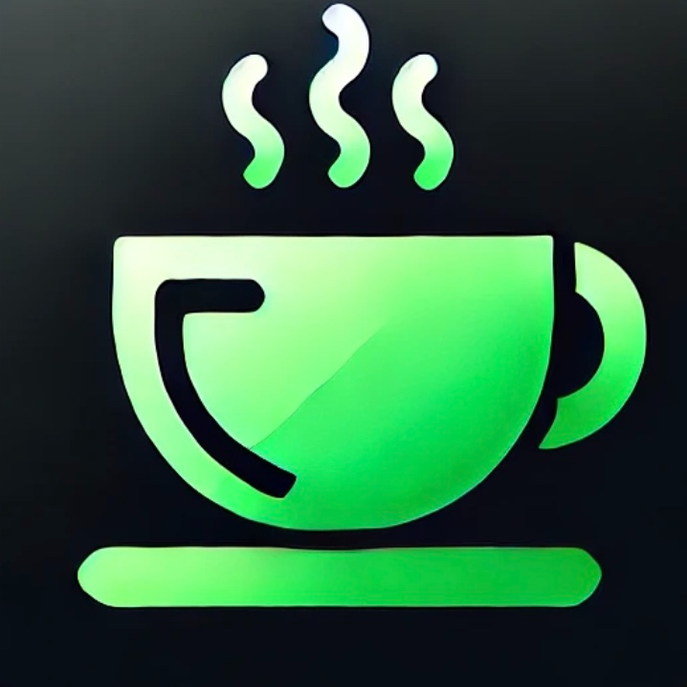
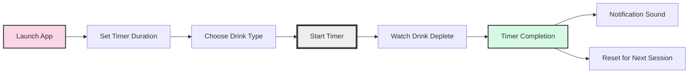
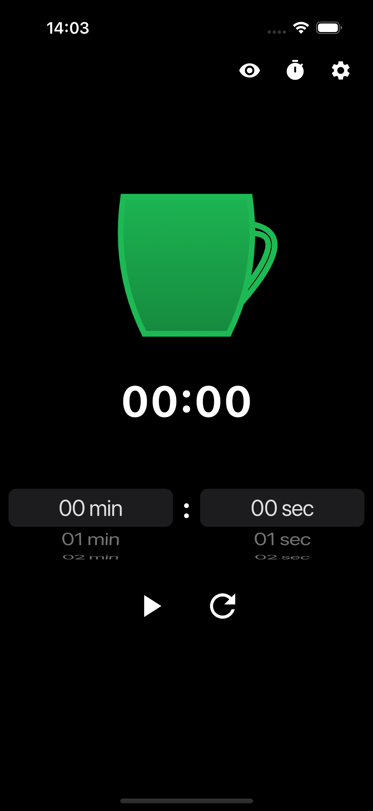
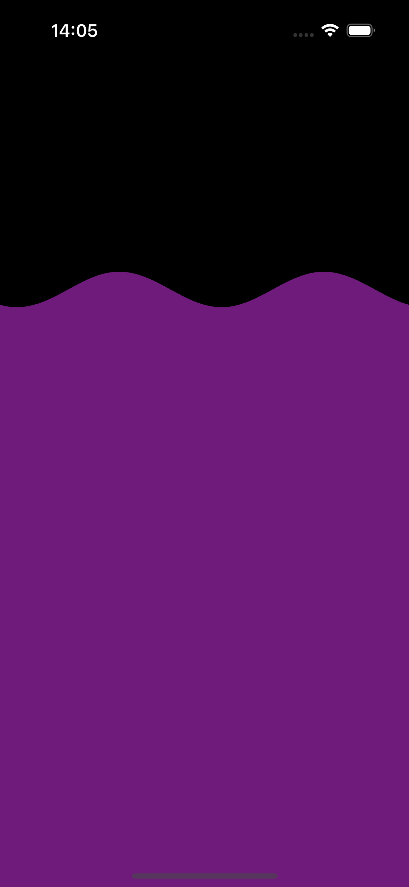
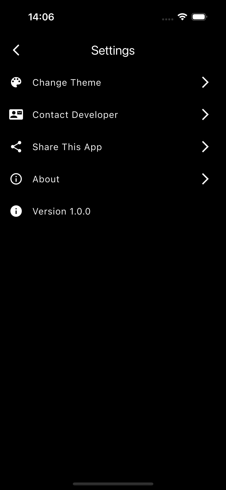
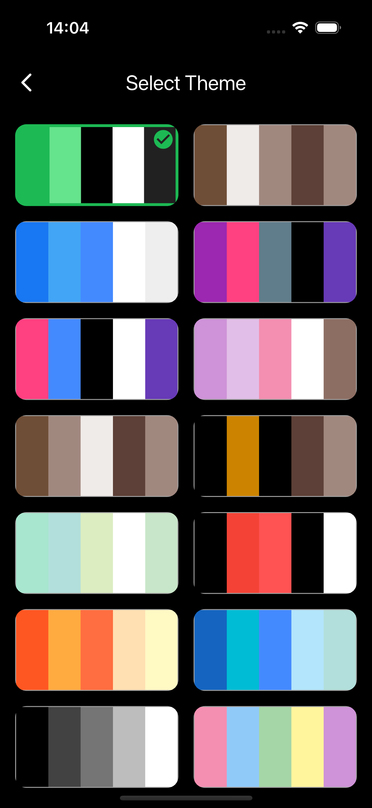
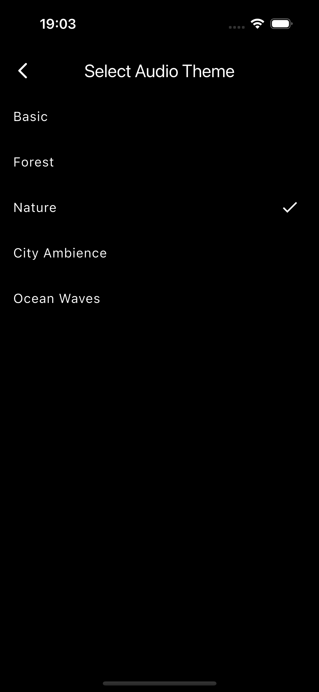
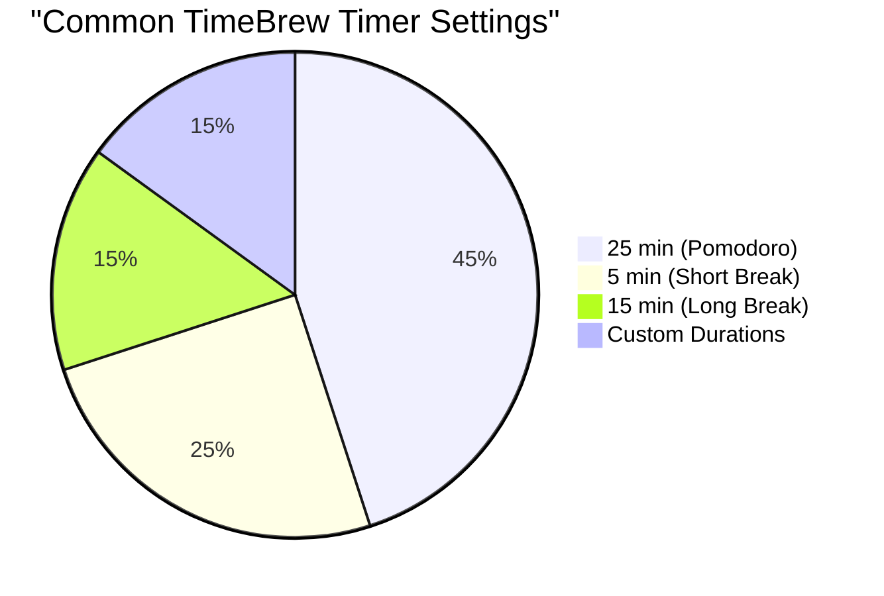
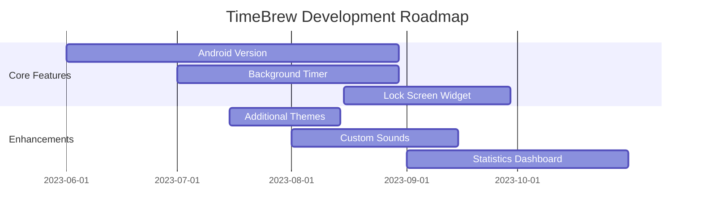

# ⏱️ TimeBrew App ☕

<div align="center">



[](https://apps.apple.com/gb/app/timebrew/id6737444597)
[](https://flutter.dev)
[](https://apps.apple.com/gb/app/timebrew/id6737444597)
[](https://github.com/Felixburton7/timebrew_app)

*A minimalist timer app designed for focused productivity sessions*

</div>

## 📋 Table of Contents
- [Overview](#-overview)
- [Key Features](#-key-features)
- [App Workflow](#-app-workflow)
- [Screenshots](#-screenshots)
- [Installation](#-installation)
- [Usage](#-usage)
- [Contributing](#-contributing)
- [Roadmap](#-roadmap)
- [Contact](#-contact)

## 🌟 Overview

TimeBrew transforms your productivity sessions into a delightful visual experience. Watch as your selected drink (coffee, beer, or water) gradually depletes to visualize the passage of time. Perfect for study techniques like the Pomodoro method, TimeBrew makes time management both effective and enjoyable.

Built with Flutter and available on iPhone and iPad across 175 countries, this open-source app combines functionality with beautiful aesthetics to enhance your focus sessions.

## ✨ Key Features

| Feature | Description |
|---------|-------------|
| 🥤 **Interactive Drink Timer** | Set a timer, choose a drink, and watch it gradually empty, showing remaining time in a visually engaging way |
| 🎨 **Customizable Themes** | Personalize with themes including Coffee, Ocean, Space, and more |
| 🔄 **Smooth Animations** | Enjoy fluid, visually pleasing drink depletion animations |
| ⚙️ **Flexible Settings** | Easily change themes, sounds, and other preferences |
| 📱 **Intuitive Design** | Simple, distraction-free interface optimized for productivity |

## 🔄 App Workflow



## 📸 Screenshots

### Home Page (Timer View)

The main page lets users set the timer duration, select a drink type, and start the timer. As time progresses, the drink depletes to signify the remaining time.

<p align="center">
  
</p>

The `TimerView` uses the TimerBloc to manage timer functionality, including start, pause, and reset. It features unique animations for each drink type that change based on user interaction.

### Coffee Cup & Full-Screen Liquid Timer Examples

The app features multiple drink types, each with unique animations that provide a visual representation of your remaining time.

<p align="center">
  
  
</p>

### Theme/Audio Selection & Settings

Customize your TimeBrew experience with different visual themes and audio options:

<p align="center">
  
  
  
</p>

## 💻 Installation

### Requirements
- Flutter SDK (latest stable version)
- Dart SDK (latest stable version)
- iOS 13.0+ / iPadOS 13.0+
- Android 5.0+ (coming soon)

### Setup Instructions

1. **Clone the Repository**:
   ```bash
   git clone https://github.com/Felixburton7/timebrew_app.git
   cd timebrew_app
   ```

2. **Install Dependencies**:
   ```bash
   flutter pub get
   ```

3. **Run the App**:
   ```bash
   flutter run
   ```

## 📊 Usage

TimeBrew is designed for various productivity techniques, with the Pomodoro method being a popular choice:



### Pomodoro Technique with TimeBrew:
1. 🍅 Set a 25-minute timer for focused work
2. ☕ Watch your coffee (or chosen drink) deplete as you work
3. ✅ Take a 5-minute break when the timer completes
4. 🔄 Repeat 4 times, then take a longer 15-30 minute break

## 🤝 Contributing

TimeBrew is an open-source project, and we welcome your contributions! Here are some areas where you can help:

### Priority Enhancements
- 🔊 **More Sounds**: Add new sound effects for timer start, pause, and completion
- 📱 **Background Connectivity**: Enhance functionality for background operation
- 🔒 **Lock Screen Widget**: Create a widget for quick access from the lock screen

### How to Contribute
1. Fork the repository
2. Create a feature branch: `git checkout -b feature/amazing-feature`
3. Commit your changes: `git commit -m 'Add some amazing feature'`
4. Push to the branch: `git push origin feature/amazing-feature`
5. Open a Pull Request

## 🗺️ Roadmap



## 📞 Contact

<div align="center">

**Developed with ❤️ by Felix Burton**

[](mailto:felixburton2002@gmail.com)
[](https://github.com/Felixburton7)

</div>

---

<div align="center">
  <sub>Remember: Good timing brews great results! ⏱️☕</sub>
</div>
